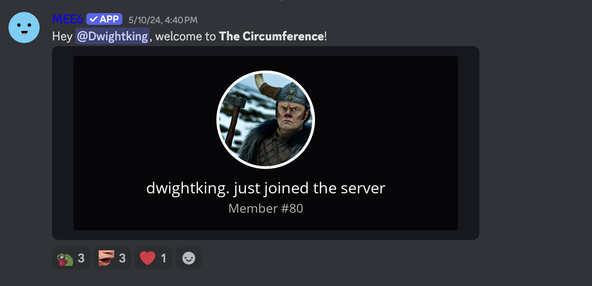
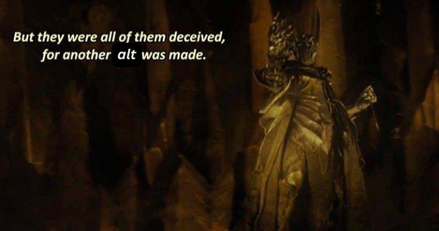
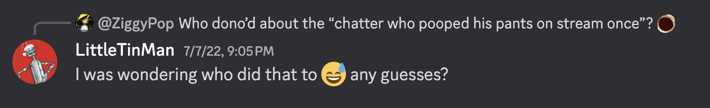
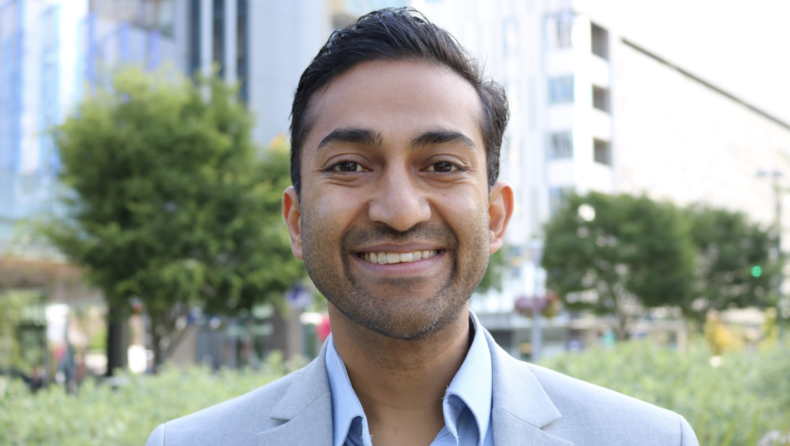
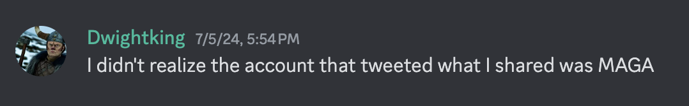
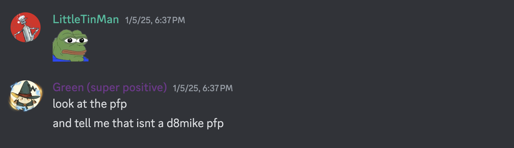
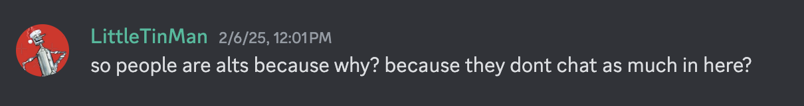
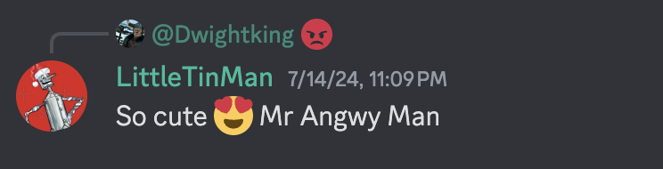
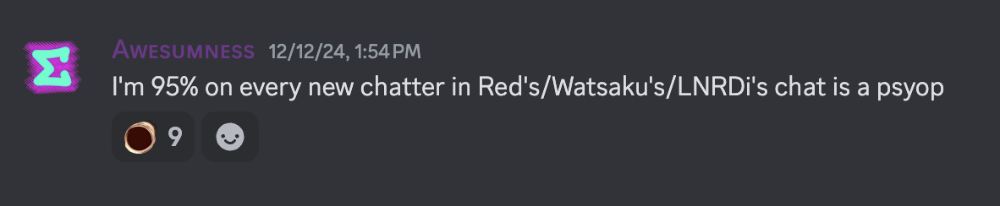
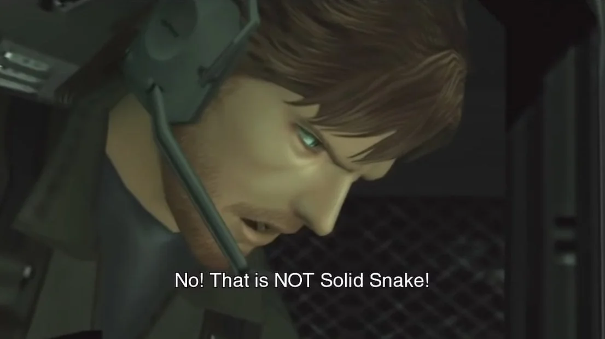

# The LittleTinManifesto

Here, I explain why Dwightking and LittleTinMan are likely alt accounts that belong to D8Mike.

First, I explain how I initially became suspicious of these accounts. Then, I present additional evidence to support my theory.

Note: Almost all of D8Mike's messages have been deleted from The Circumference, so I can't provide as many receipts as I would like to. I sometimes have to recall events from memory, so I may get some details wrong.

## 1. Dwightking

Here's a timeline of Dwightking's arrival to red_radius's community.

- On May 10, 2024, a Discord account with the username "Dwightking" is created and joins The Circumference server the very same day ([screenshot](images/1/DkCreationAndJoinDate.png)). To my knowledge, Dwightking has no presence in other servers, no activity on other platforms, and has never interacted in red_radius’s stream.
- Within five minutes of joining, Dwightking has a brief exchange with D8Mike, marking his only conversation that day ([screenshot](images/1/DkFirstConversation.png)). They discuss the wordplay in Dwightking’s username and their shared fandom for The Office. D8Mike then offers to DM an invite to his dedicated fan server for The Office--a server that, as far as I can tell, was never mentioned before or after this interaction.
- A few hours later, D8Mike announces he is permanently leaving The Circumference for mental health reasons. After this, Dwightking remains completely inactive in the server for a full month ([screenshot](images/1/DkInactivity.png)).

From the outset, several red flags stood out:

- The suspicious timing of Dwightking’s account creation and immediate arrival, just before D8Mike’s departure.
- The complete lack of prior presence in red_radius’s community or anywhere else.
- The bizarre and seemingly contrived first interaction, followed by radio silence.
- The new account's on-the-nose references to D8Mike's namesake and favorite TV show.

It didn’t take long to conclude that Dwightking was, in my estimation, one of the most obvious alt accounts of all time.

But what I didn’t expect was that this alt would lead to the discovery of another--one that had successfully blended into red_radius’s community for years, undetected.

## 2. LittleTinMan

LittleTinMan has been an active member of red_radius’s community since at least December 13, 2022, when he joined The Circumference ([screenshot](images/2/LtmJoin.png)). Before that, he was part of GappyV’s community ([screenshot](images/2/LtmGappy.png)). LittleTinMan's account was created 6 days before his first message in GappyV's server ([1](images/2/LtmCreation.png) | [2](images/2/LtmFirstMessage.png)).

The first hint of a connection between LittleTinMan and Dwightking appeared on June 8, 2024, when LittleTinMan responded to a YouTube link Dwightking posted in red_radius’s server, asking: “Is this what you texted me? 😂” ([screenshot](images/2/LtmDkFirstConversation.png)). At the time, it was possible D8Mike, as Dwightking, was just sharing a DM with another community member. Nothing too suspicious.

Then, things took a strange turn.

Dwightking and LittleTinMan started posting nearly identical messages ([1](images/2/DkMedical.png) | [2](images/2/LtmMedical.png) | [3](images/2/DkBiden.png) | [4](images/2/LtmBiden.png)).

Based on the similarities between the messages, I began suspecting that Dwightking and LittleTinMan were actually the same person. And since I was already confident that Dwightking was a D8Mike alt, it seemed likely that LittleTinMan was as well.

Not long after I began suspecting LittleTinMan was an alt, a new development emerged on July 13: the two were in a relationship ([screenshot](images/2/LtmDkCouple.png)).

When I saw LittleTinMan pretending to date and live with someone I was certain didn’t exist, I knew he was lying--to say nothing of the fact that the exchange itself was awkward and performative. In that moment, my suspicions of an alt account conspiracy were confirmed.

Still, some might be hesitant to reach the same conclusion. Maybe, for these skeptics, the supposed relationship between Dwightking and LittleTinMan is enough to explain away oddities--like their near-identical messages or Dwightking appearing out of nowhere and instantly joining The Circumference upon account creation.

If you’re still unconvinced, here are a few more observations that reinforce why I believe these are alt accounts.

## 3. Other observations

### 3.1. LittleTinMan sure talks a lot about D8Mike

While reviewing LittleTinMan’s logs from the Gapcord, I noticed something unusual--D8Mike was everywhere. Out of the 108 messages LittleTinMan posted, I counted 30 that talked about or replied to D8Mike, with another six potentially referencing him (though harder to confirm). That means a staggering 28-33% of LittleTinMan’s messages revolved around a single person--a remarkably high percentage. For comparison, Feznet, who is jokingly referred to as a Green alt due to their frequent interactions, only talked about or replied to Green in 17 of his first 108 messages in The Circumference.

But beyond the sheer volume of messages referencing D8Mike, what makes them even more intriguing is their content. LittleTinMan does a few things that you might expect someone to do with a burner account.

- Fishing for compliments and recognition from other chatters ([1](images/3/1/Fishing/1.png) | [2](images/3/1/Fishing/2.png)* | [3](images/3/1/Fishing/3.png)* | [4](images/3/1/Fishing/4.png)*).
- Boosting D8Mike's memes ([1](images/3/1/Boosting/1.png) | [2](images/3/1/Boosting/2.png) | [3](images/3/1/Boosting/3.png) | [4](images/3/1/Boosting/4.png)* | [5](images/3/1/Boosting/5.png)*).
- Offering positive affirmation, especially when no one else does ([1](images/3/1/Affirming/1.png) | [2](images/3/1/Affirming/2.png)).
- Providing D8Mike soapboxes to talk about topics he cares about. If the burner account is feigning an opposing view, the pushback is limp or exaggerated into a caricature of the opposition ([1](images/3/1/Prompting/1.png) | [2](images/3/1/Prompting/2.png) | [3](images/3/1/Prompting/3.png) | [4](images/3/1/Prompting/4.png) | [5](images/3/1/Prompting/5.png)).
- Noticing before others when D8Mike leaves the server and posts to his other social media accounts, and making sure to call people's attention to it ([1](images/3/1/Noticing/1.png) | [2](images/3/1/Noticing/2.png) | [3](images/3/1/Noticing/3.png)).

*These are logs that I suspect are about D8Mike but can't confirm due to deleted messages, closed channels, or other reasons.

While none of these behaviors alone are conclusive, the consistency and volume of these interactions stand out.

### 3.2. Vinay Prasad

Vinayak K. Prasad is an American hematologist-oncologist and health researcher, currently serving as a professor of Epidemiology and Biostatistics at the University of California, San Francisco. Alongside his medical and academic work, Prasad runs a YouTube channel where he covers a wide range of topics, often focusing on medicine, healthcare policy, and the COVID-19 pandemic.

D8Mike has publicly stated that he’s a fan of Prasad. He has shared Prasad's videos for react content on red_radius’s stream and, in previous conversations in The Circumference, D8Mike has defended Prasad against those who attempt to discredit Prasad based on his heterodox, conservative-leaning views--particularly those related to the US's COVID-19 pandemic response.

Prasad enjoys a respectable online following, with 193K subscribers on YouTube and 60K followers on Substack. However, based on what I’ve seen, his audience is overwhelmingly conservative. Despite his reach, he’s still niche enough that it’s highly unlikely a random person who doesn't closely follow conservative discourse around health and medicine would know who he is, or follow his Substack. In fact, I'd wager that not a single person in red_radius's community besides D8Mike is familiar with Prasad or follows his work.

Except, for some reason, Dwightking ([screenshot](images/3/2/DkPrasad.png)).

### 3.3. Political inconsistencies

Let’s do a thought experiment. Imagine you open someone’s phone, scroll through their social media feed, and see their algorithm has surfaced these posts. Based on what you see, what political affiliation would you assume they have?

[Post 1](https://x.com/CurtisHouck/status/1854568993689833774) ([Log](images/3/3/DkLinks/Cnn1.png)),
[Post 2](https://x.com/ggreenwald/status/1819808795196883262) ([Log](images/3/3/DkLinks/Cnn2.png)),
[Post 3](https://x.com/GadSaad/status/1816290479694307682) ([Log](images/3/3/DkLinks/GadSaad.png)),
[Post 4](https://www.washingtonpost.com/opinions/2024/11/15/pennsylvania-senate-casey-provisional-ballots/) ([Log](images/3/3/DkLinks/Ballots.png)),
[Post 5](https://x.com/JudiciaryGOP/status/1828201780544504064) ([Log](images/3/3/DkLinks/Facebook.png)),
[Post 6](https://www.drvinayprasad.com/p/do-other-countries-do-it-a-simple) ([Log](images/3/3/DkLinks/Prasad.png)),
[Post 7](https://x.com/Richard93494430/status/1844140671948702146) ([Log](images/3/3/DkLinks/DarkMaga.png)),
[Post 8](https://www.nytimes.com/2024/07/12/us/politics/biden-donors-money.html) ([Log](images/3/3/DkLinks/Donors.png)),
[Post 9](https://x.com/BehizyTweets/status/1840181037739000255) ([Log](images/3/3/DkLinks/Levi.png)),
[Post 10](https://x.com/EmeraldRobinson/status/1827337982241558610) ([Log](images/3/3/DkLinks/Fauci.png)),
[Post 11](https://x.com/realDonaldTrump/status/1844569515851411802) ([Log](images/3/3/DkLinks/Kamala.png)),
[Post 12](https://www.youtube.com/watch?v=x9L5K04VgkI) ([Log](images/3/3/DkLinks/ChosenOne.png)),
[Post 13](https://x.com/ShrinkGov/status/1827083570420351377) ([Log](images/3/3/DkLinks/JohnStewart.png)),
[Post 14](https://youtu.be/GPKNv25HjZc?si=5Dt-olaINfRZ_Y-8) ([Log](images/3/3/DkLinks/Biden.png)),
[Post 15](https://x.com/JillianMichaels/status/1817235506687783374) ([Log](images/3/3/DkLinks/Olympics.png)),
[Post 16](https://x.com/Robertfrank615/status/1812260155805008016) ([Log](images/3/3/DkLinks/ChestDay.png)),
[Post 17](https://x.com/Timcast/status/1816464836022190450) ([Log](images/3/3/DkLinks/TimPool.png)),
[Post 18](https://x.com/AB84/status/1812256577149350380) ([Log](images/3/3/LtmLinks/AB84.png)),
[Post 19](https://x.com/ericmmatheny/status/1812674401831170142) ([Log](images/3/3/LtmLinks/Ad.png)),
[Post 20](https://youtube.com/shorts/odZc8DcMpP8?si=3uMpjEfol4w0HvLL) ([Log](images/3/3/LtmLinks/Biden.png)),
[Post 21](https://www.newsweek.com/republicans-mock-biden-after-filling-gaps-trumps-border-wall-approved-1729261) ([Log](images/3/3/LtmLinks/Border.png)),
[Post 22](https://www.washingtonpost.com/national-security/2024/07/15/trump-classified-trial-dismisssed-cannon/) ([Log](images/3/3/LtmLinks/Dismiss.png)),
[Post 23](https://x.com/TPostMillennial/status/1732048939652960621) ([Log](images/3/3/LtmLinks/Kendi.png)),
[Post 24](https://www.cnn.com/2024/07/16/politics/bob-menendez-verdict/index.html) ([Log](images/3/3/LtmLinks/Menendez.png)),
[Post 25](https://x.com/ForgiatoBlow47/status/1661861660351516674) ([Log](images/3/3/LtmLinks/Target.png))

Chances are, you’d conclude that the person leans conservative. Interestingly, a majority of the political content that Dwightking and LittleTinMan share in The Circumference carries a subtle--if not overt--pro-conservative, anti-left slant, regardless of how they frame the content in conversation.

That’s odd, considering both Dwightking and LittleTinMan have expressed strong left-wing, anti-conservative views--though, notably, in a way that often reads like a conservative overcompensating to sound like a liberal ([1](images/3/3/DkLeft1.png) | [2](images/3/3/LtmLeft1.png) | [3](images/3/3/LtmLeft2.png)). In fact, sometimes the brief remarks they pair with their posts also come off as a conservative caricature of liberals, such as when Dwightking insisted that illegal votes should be counted to favor Democrats ([1](images/3/3/DkLinks/Ballots.png) | [2](images/3/3/CountTheVotes.png)).

However, when they choose to engage more substantively in political discussions, their views start to hint towards a more right-wing bias ([1](images/3/3/Conservative/Dk.png) | [2](images/3/3/Conservative/Ltm.png)).

Taken together, the evidence suggests a reasonable likelihood that these accounts are actually run by someone conservative posing as liberals. And, as it happens, D8Mike is known to have conservative leanings. Curious.

### 3.4. Dwightking and LittleTinMan are D8Mike-coded

You know that feeling when you see a meme about some obscure theological, philosophical, or historical concept, and immediately think, "This is so DrConcepts/Casaubon-coded"? That’s exactly how I feel when reading Dwightking and LittleTinMan’s messages--except in this case, they’re D8Mike-coded.

It’s a bit difficult to explain, so I’ll just lay out a few examples and let you decide for yourself:

- LittleTinMan talks about sex in an out-of-pocket way that reminds me of D8Mike's uncanny sense of humor. The messages come across more like a straight person's caricature of a sexually open gay person than an actual gay person. ([1](images/3/4/Ltm/Banging.png) | [2](images/3/4/Ltm/Ripe.png) | [3](images/3/4/Ltm/Dominate.png) | [4](images/3/4/Ltm/Fluids.png))
- Most of the memes Dwightking posts have a distinct D8Mike energy. In fact, I’m pretty sure D8Mike has shared images from the exact same artists featured in these screenshots multiple times. ([1](images/3/4/Memes/Rough.png) | [2](images/3/4/Memes/Boxing.png) | [3](images/3/4/Memes/Dog.png) | [4](images/3/4/Memes/Gay.png) | [5](images/3/4/Memes/ChosenOne.png), [video](https://youtu.be/x9L5K04VgkI?si=d0lv6g240XkzDfA5))
- D8Mike has a very specific way of stylizing his usernames and profile pictures--often basing them on different characters in a way that’s oddly... uncanny. This pattern extends beyond his own account (where he’s been, at various times, a secret agent, a marshmallow man, and a giant Pop-Tart) and can also be seen in Dwightking and LittleTinMan’s accounts. And I’m not the only one who’s noticed. ([1](images/3/4/Green/Green1.png) | [2](images/3/4/Green/Green2.png) | [3](images/3/4/Green/Green3.png))

### 3.5. Message frequency

One possible motivation for the alt accounts could be to stay connected with red_radius’s community during D8Mike's recurring absences from the server. If this theory holds, we would expect Dwightking and LittleTinMan to be more active when D8Mike is "away" and less active when he returns--though they would still need to post occasionally to maintain the illusion of being independent users.

D8Mike returned to the server on September 24, 2024 ([screenshot](images/3/5/D8MikeRejoin.png)), before leaving again sometime before January 28, 2025 ([screenshot](images/3/5/D8MikeGone.png)). This allows us to compare two distinct periods:

- May 10--September 24 (137 days, D8Mike absent)
    - Dwightking: 160 messages (1.17 per day) ([screenshot](images/3/5/Dk1.png))
    - LittleTinMan: 44 messages (0.32 per day) ([screenshot](images/3/5/Ltm1.png))
    - Server total: 58,686 messages (428 per day) ([screenshot](images/3/5/Server1.png))
- September 24--January 28 (126 days, D8Mike present)
    - Dwightking: 61 messages (0.48 per day) ([screenshot](images/3/5/Dk2.png))
    - LittleTinMan: 12 messages (0.10 per day) ([screenshot](images/3/5/Ltm2.png))
    - Server total: 119,726 messages (950 per day) ([screenshot](images/3/5/Server2.png))

During D8Mike’s return, Dwightking’s messaging frequency dropped to 41% of its previous rate, while LittleTinMan’s dropped even further, to 31%. Meanwhile, overall server activity more than doubled, increasing to 220% of the pre-return rate.

Adding to the pattern, LittleTinMan posted 33 messages in just 10 days after D8Mike left on January 28--nearly three times the number of messages he posted in the entire 126 days prior ([screenshot](images/3/5/Ltm3.png)).

### 3.6 The fakest relationship of all time

I don't really have much commentary to add here. These conversations and public displays of affection just seem incredibly canned and artificial to me ([1](images/3/6/1.png) | [2](images/3/6/2.png)).

## 4. So what?

By now, the weight of the evidence strongly suggests that Dwightking and LittleTinMan are not real individuals but crafted personas designed to extend the presence of one person: D8Mike. While any individual anomaly might be dismissible in isolation, the cumulative evidence and broader patterns indicate a deliberate effort at sockpuppeting.

This realization raises uncomfortable questions about intent. Was this a strategy to boost his own credibility and influence discussions? A form of escapism, allowing him to roleplay different personas and troll others? Or simply a way for him to stay engaged with the server while maintaining the appearance of absence?

While I don't have definitive answers, the sheer length of time and effort dedicated to sustaining this scheme suggests that D8Mike may be struggling with deeper personal issues--possibly mental illness. If that's the case, I have some sympathy for him. Creating and maintaining multiple accounts for this long isn't just deceptive; it's exhausting. Whatever his reasons, it's clear that this behavior isn't healthy, either for him or for the community.

At first, I was content to leave the issue alone and simply limit my own interactions with these alt accounts. However, it's becoming increasingly unsettling to watch others be misled for years, believing they’re engaging with real people ([1](images/4/Deceived/1.png) | [2](images/4/Deceived/2.png) | [3](images/4/Deceived/3.png) | [4](images/4/Deceived/4.png) | [5](images/4/Deceived/5.png) | [6](images/4/Deceived/6.png) | [7](images/4/Deceived/7.png) | [8](images/4/Deceived/8.png)). And these are just the alts that I've discovered--who's to say there aren't more? After all, LittleTinMan stayed undetected in both this community and Gappy's for years.

So what should be done about this? My goal isn't to humiliate or punish D8Mike. In retrospect, I was reckless when I publicly called him out for using alts a few days ago. But staying silent and playing along doesn't feel right either. Or maybe staying silent is the best option if there's no graceful off-ramp for D8Mike and no better alternative exists. I don't know--this is where I hit a wall. For now, I think the main takeaway is this.

These fake characters are giving me serious MGS2 vibes.

